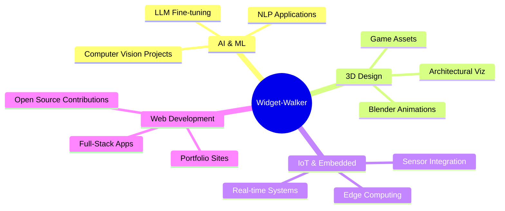

<div align="center">
# 👋 Hey, I'm Widget-Walker! 

<p align="center">
  <a href="mailto:dheeraj5765483@gmail.com"></a>
  <a href="https://linkedin.com/in/pillidheeraj"></a>
  <a href="https://github.com/widgetwalker"></a>
  <a href="https://portfolio-six-puce-65.vercel.app"></a>
</p>

</div>
## 🚀 About Me
> *Passionate tech enthusiast crafting innovative solutions at the intersection of AI, 3D design, and embedded systems*
I'm a **multi-disciplinary developer** with a burning passion for pushing technological boundaries. From training neural networks to sculpting immersive 3D worlds, I thrive on transforming complex ideas into elegant, functional realities. Currently interning at **AICPECF** while leading cutting-edge projects that blend creativity with technical precision.
```python
class WidgetWalker:
    def __init__(self):
        self.name = "Dheeraj Pilli"
        self.role = "AI Engineer & 3D Artist"
        self.location = "India 🇮🇳"
        self.current_focus = ["LLMs", "Computer Vision", "3D Animation", "IoT"]
        self.fun_fact = "I can debug code and render 3D scenes simultaneously! 🎨💻"
    
    def say_hi(self):
        print("Thanks for dropping by! Let's build something epic together! 🚀")
me = WidgetWalker()
me.say_hi()
```
---
## 🛠️ Tech Arsenal
<div align="center">
### 💻 Languages


### 🤖 AI & Machine Learning


### 🎨 3D & Creative Tools


### 🔧 Frameworks & Tools


### 🎯 Expertise Domains
```
🤖 AI & ML          ████████████████████░   95%
🎨 3D Modeling      ███████████████████░░   90%
⚡ Embedded Systems ██████████████████░░░   85%
💾 Database Design  ████████████████░░░░░   80%
🌐 Web Development  ███████████████░░░░░░   75%
```
</div>
---
## 🌟 Featured Projects
<div align="center">
### 🔥 Pinned Repositories
</div>
<details open>
<summary><b>🤖 AI & Machine Learning Projects</b></summary>
<br>
<table>
<tr>
<td width="50%">
### 📸 [AI Image Caption Generator](https://github.com/widgetwalker/image-caption)
**AI-powered caption generation using BLIP model**
- 🎯 Upload images or capture via webcam
- 🧠 Powered by Salesforce BLIP transformer
- 💾 SQLite database with history tracking
- 🎨 Beautiful Streamlit interface
**Tech Stack:** `Python` `PyTorch` `Transformers` `OpenCV` `Streamlit`
[](https://github.com/widgetwalker/image-caption)
</td>
<td width="50%">
### 🔐 [Credit Card Fraud Detection](https://github.com/widgetwalker/credit-card-fraud-detection)
**ML system for real-time fraud detection**
- 📊 Advanced ML algorithms
- ⚡ Real-time prediction capabilities
- 📈 High accuracy anomaly detection
- 🛡️ Comprehensive security analysis
**Tech Stack:** `Python` `Scikit-learn` `Pandas` `NumPy`
[](https://github.com/widgetwalker/credit-card-fraud-detection)
</td>
</tr>
<tr>
<td width="50%">
### 👁️ [Image Detection Projects](https://github.com/widgetwalker/image-detection-projects)
**Computer vision for theft detection & security**
- 🎥 Real-time object detection with YOLO
- 🔍 Theft detection algorithms
- 📹 Security monitoring systems
- 🚨 Alert generation mechanisms
**Tech Stack:** `Python` `YOLO` `OpenCV` `Computer Vision`
[](https://github.com/widgetwalker/image-detection-projects)
</td>
<td width="50%">
### 💬 [AI Chatbot](https://github.com/widgetwalker/ai_chat_bot)
**Lightweight, customizable AI chatbot** ⭐ 1
- 🧠 Natural language processing
- 🎨 Clean, responsive UI
- 🔧 Easy customization
- ⚡ Fast response times
**Tech Stack:** `HTML` `JavaScript` `NLP` `AI`
[](https://github.com/widgetwalker/ai_chat_bot)
</td>
</tr>
</table>
</details>
<details open>
<summary><b>🎨 3D Graphics & Visualization</b></summary>
<br>
<table>
<tr>
<td width="50%">
### 🎮 [3D OBJ Viewer](https://github.com/widgetwalker/3d-viewer)
**Python-based 3D model viewer with advanced features**
- 🖼️ Interactive camera controls
- 🎨 Texture mapping support
- ✨ Custom shader implementation
- 🔄 Multiple view modes (wireframe/solid)
- 📦 Material support
**Tech Stack:** `Python` `Pygame` `NumPy` `OpenGL`
[](https://github.com/widgetwalker/3d-viewer)
</td>
<td width="50%">
### 🌌 Blender Masterpieces
**Professional 3D modeling & animation**
- 🎬 **DimensionX**: Immersive 3D environments
- 🚀 **Sci-fi Scene**: Cinematic rendering
- ⚓ **Origins of Navy Comic**: Digital artistry for Indian Navy
- 🎨 Advanced lighting & materials
- 🎥 Animation & rigging expertise
**Tools:** `Blender` `Autodesk Maya` `3D Modeling`
</td>
</tr>
</table>
</details>
<details open>
<summary><b>💼 Full-Stack & Web Development</b></summary>
<br>
<table>
<tr>
<td width="50%">
### 🌐 [Portfolio Website](https://github.com/widgetwalker/portfolio)
**Personal portfolio showcasing my work**
- 🎨 Modern, responsive design
- 🚀 Live project demos
- 💻 Code snippets & documentation
- ⚡ Built with React & TypeScript
**Live:** [portfolio-six-puce-65.vercel.app](https://portfolio-six-puce-65.vercel.app)
[](https://github.com/widgetwalker/portfolio)
</td>
<td width="50%">
### 📚 [Library Management System](https://github.com/widgetwalker/library-management-system)
**Modern web app for book library management**
- 📖 Book cataloging & tracking
- 👥 User management
- 🔍 Advanced search features
- 📊 Analytics dashboard
**Live:** [widgetwalker.github.io/library-management-system](https://widgetwalker.github.io/library-management-system/)
[](https://github.com/widgetwalker/library-management-system)
</td>
</tr>
<tr>
<td width="50%">
### 🙏 [Nazma Charitable Trust](https://github.com/widgetwalker/nazma_charitable_trust_web)
**Professional website for charitable organization**
- 🎨 Beautiful, accessible design
- 📱 Fully responsive
- 🌐 Multi-page architecture
- ⚡ Optimized performance
**Live:** [nazma-trust.netlify.app](https://nazma-trust.netlify.app/)
[](https://github.com/widgetwalker/nazma_charitable_trust_web)
</td>
<td width="50%">
### 📱 [AirSense5G](https://github.com/widgetwalker/airsense5g)
**Cross-platform air quality monitoring app**
- 🌍 Real-time air quality insights
- 🤖 AI-driven forecasts
- 💊 Personalized health recommendations
- 📊 Data visualization
**Tech Stack:** `Flutter` `Dart` `AI` `IoT`
[](https://github.com/widgetwalker/airsense5g)
</td>
</tr>
</table>
</details>
<details open>
<summary><b>🔧 Utility & Tools</b></summary>
<br>
<table>
<tr>
<td width="50%">
### 💰 [Personal Financer](https://github.com/widgetwalker/personal_financer)
**Python tool for personal finance management**
- 💵 Income & expense tracking
- 📊 Category-wise analysis
- 📈 Monthly summaries
- 📁 CSV export functionality
- 🔧 Modular design
**Tech Stack:** `Python` `SQLite` `Pandas`
[](https://github.com/widgetwalker/personal_financer)
</td>
<td width="50%">
### 🎮 [Simple Games](https://github.com/widgetwalker/simple-games)
**Classic arcade games in Python**
- 🐍 Snake Game
- 🎯 Smooth game mechanics
- 🎨 Clean graphics
- 🕹️ Engaging gameplay
**Tech Stack:** `Python` `Pygame` `Turtle Graphics`
[](https://github.com/widgetwalker/simple-games)
</td>
</tr>
</table>
</details>
---
## 🏆 Achievements & Recognition
<div align="center">
<table>
<tr>
<td align="center" width="33%">
### 🥇 1st Prize
**Project Competition**<br>
4th Regional Conclave<br>
*The Institution of Engineers (India)*
</td>
<td align="center" width="33%">
### 🥈 2nd Prize
**Model/Idea Competition**<br>
4th Regional Conclave<br>
*The Institution of Engineers (India)*
</td>
<td align="center" width="33%">
### 💻 Smart India Hackathon
**Team Leader**<br>
National Hackathon<br>
*Led rockstar team*
</td>
</tr>
</table>
<table>
<tr>
<td align="center" width="50%">
### 🌐 IoT Innovator
Built system software for **award-winning IoT projects**<br>
🏆 1st & 2nd Place Wins
</td>
<td align="center" width="50%">
### 💼 AICPECF Intern
Currently diving into **real-world tech development**<br>
🚧 Building production systems
</td>
</tr>
</table>
</div>
---
## 📊 GitHub Analytics
<div align="center">


### 🏅 GitHub Trophies

</div>
---
## 💡 What I'm Currently Working On
<div align="center">

</div>
---
## 🎯 Skills Matrix
<div align="center">
| Domain | Technologies | Proficiency |
|--------|-------------|-------------|
| **AI/ML** | PyTorch, Transformers, OpenCV, YOLO | ████████████████████ 95% |
| **3D Graphics** | Blender, Maya, Pygame, OpenGL | ███████████████████ 90% |
| **Embedded Systems** | C, C++, IoT, Sensors | ██████████████████ 85% |
| **Backend** | Python, SQLite, APIs | ████████████████ 80% |
| **Frontend** | React, TypeScript, HTML/CSS | ███████████████ 75% |
| **Mobile** | Flutter, Dart | ██████████████ 70% |
</div>
---
## 🌈 Fun Facts & Interests
<div align="center">
```javascript
const widgetWalker = {
    pronouns: "He/Him",
    code: ["Python", "C", "C++", "JavaScript", "TypeScript", "Dart"],
    askMeAbout: ["AI", "3D Design", "IoT", "Web Dev", "Game Dev"],
    technologies: {
        ai: ["PyTorch", "Transformers", "OpenCV", "YOLO"],
        design: ["Blender", "Maya", "Pygame"],
        web: ["React", "Flutter", "Streamlit"],
        databases: ["SQLite", "MongoDB"],
        misc: ["Git", "NumPy", "Pandas"]
    },
    currentFocus: "Building AI-powered applications and immersive 3D experiences",
    funFact: "I can debug code while rendering 3D animations! 🎨💻"
};
```
</div>
---
## 📫 Let's Connect & Collaborate!
<div align="center">
### 💬 I'm always excited to collaborate on:
🤖 **AI/ML Projects** | 🎨 **3D Design & Animation** | 🔧 **IoT & Embedded Systems** | 🌐 **Open Source Contributions**
<br>
<a href="mailto:dheeraj5765483@gmail.com">
  
</a>
<a href="https://linkedin.com/in/pillidheeraj">
  
</a>
<a href="https://github.com/widgetwalker">
  
</a>
<a href="https://portfolio-six-puce-65.vercel.app">
  
</a>
<br><br>
### 📊 Profile Views

<br>

### ⭐ Don't forget to star my repositories if you find them interesting!

---
<p align="center">
  <i>✨ "Code is like humor. When you have to explain it, it's bad." – Cory House ✨</i>
</p>
<p align="center">
  <i>💻 Built with ❤️ by Widget-Walker</i>
</p>
</div>
